# 첫단추💰


# 👋Introduction

> 우리 아이의 경제 교육 **첫 단추**를 꿰어줍니다.  
> 가정에서의 경제 조기 교육을 통해 성인이 되어서 경험할 경제 활동을 이론이 아닌 실제 활동으로 쉽고 재밌게 체험해 볼 수 있습니다.

## 🤳Simulation

### Landing

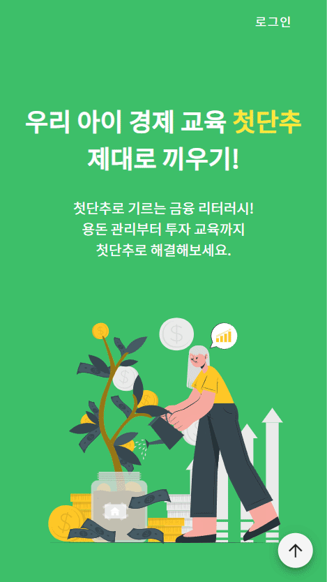

### Sign In

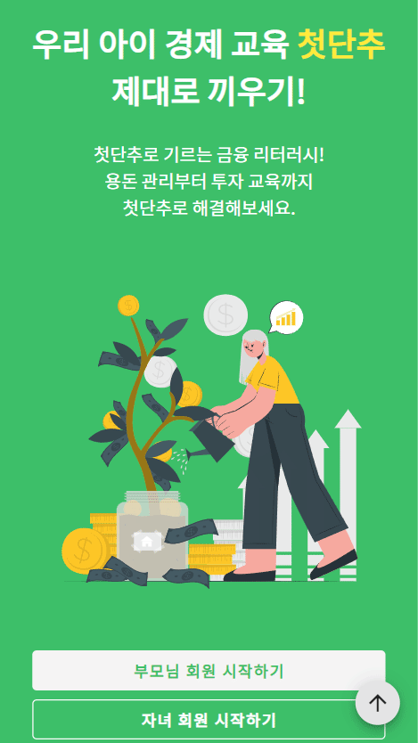
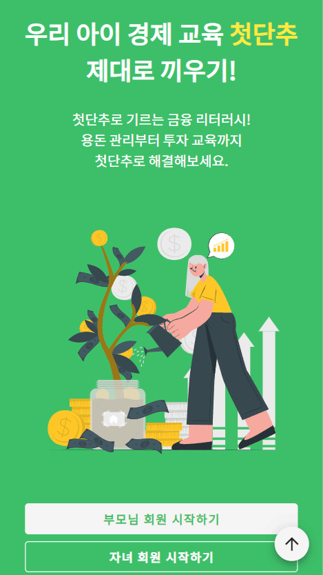

### Login

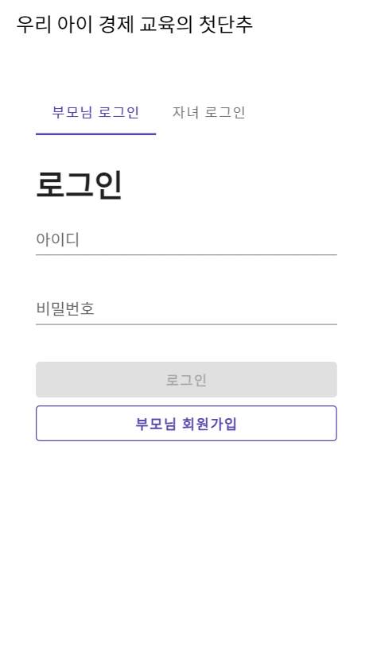
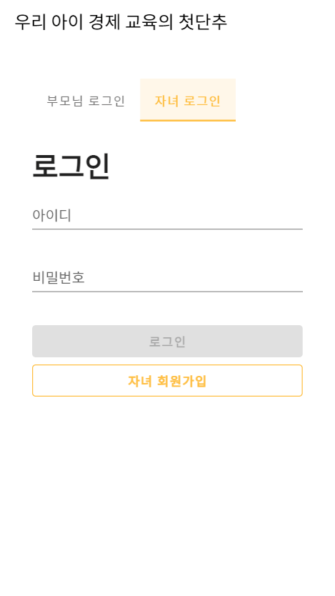

### 부모 튜토리얼

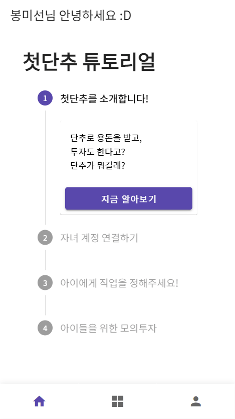
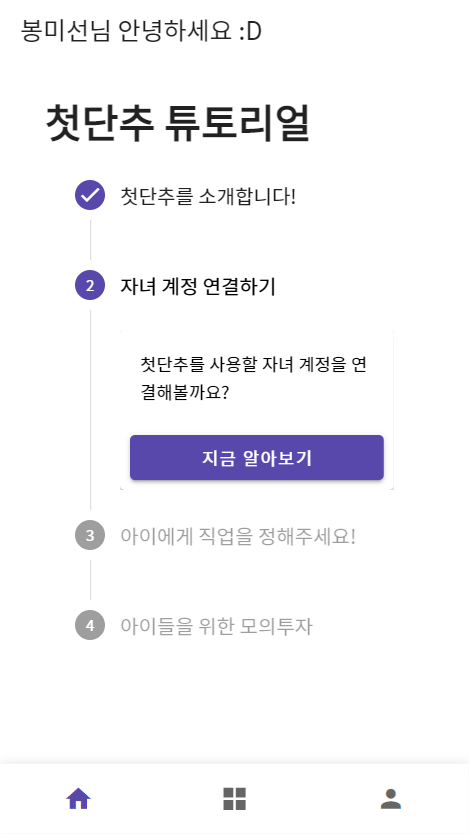
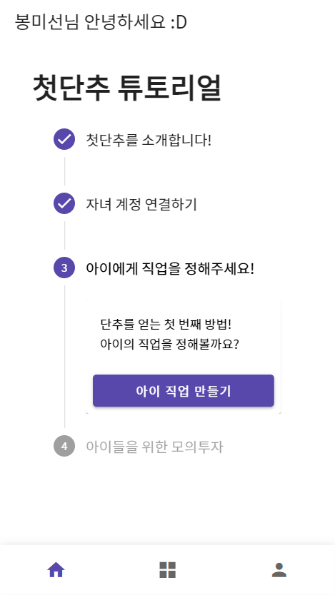
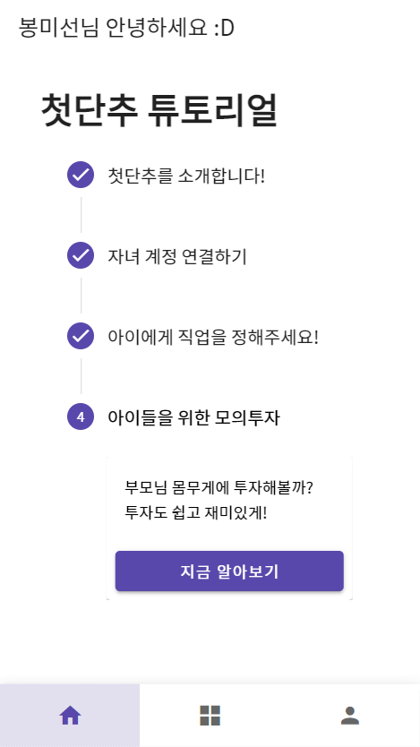

### 입금

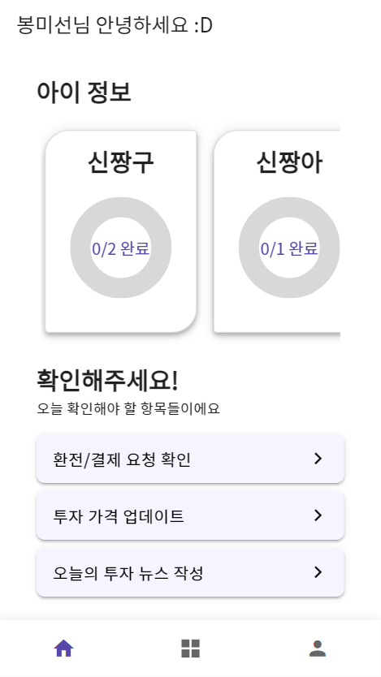
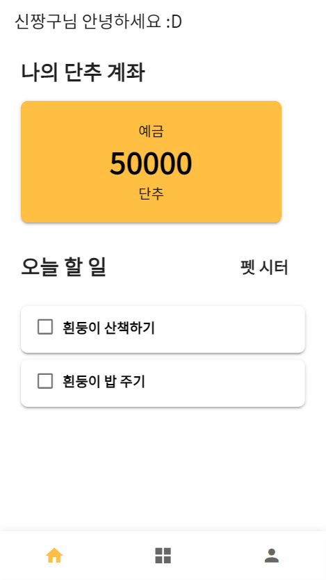

### 투자

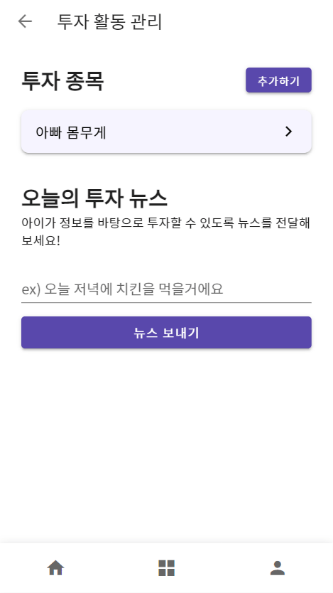


### 적금

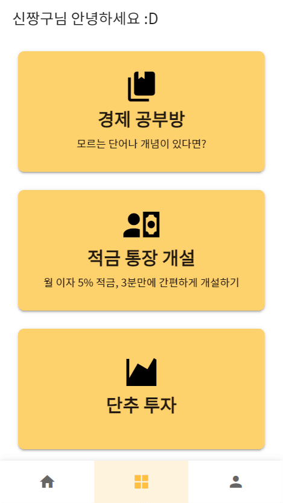

### 환전

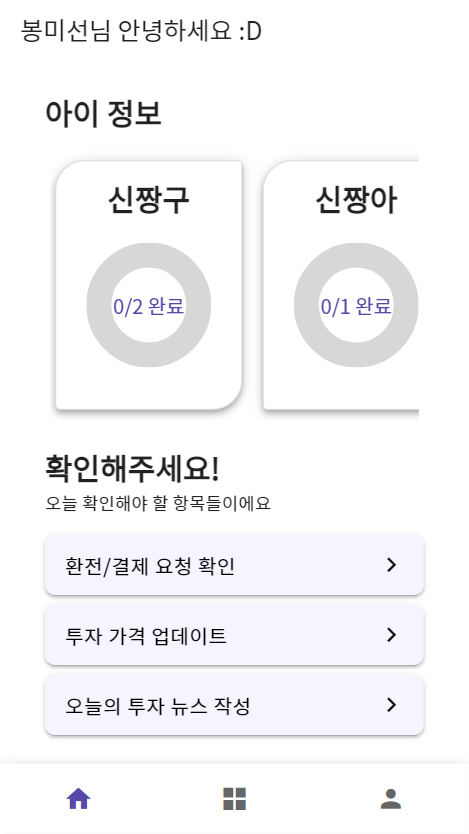


### 할 일

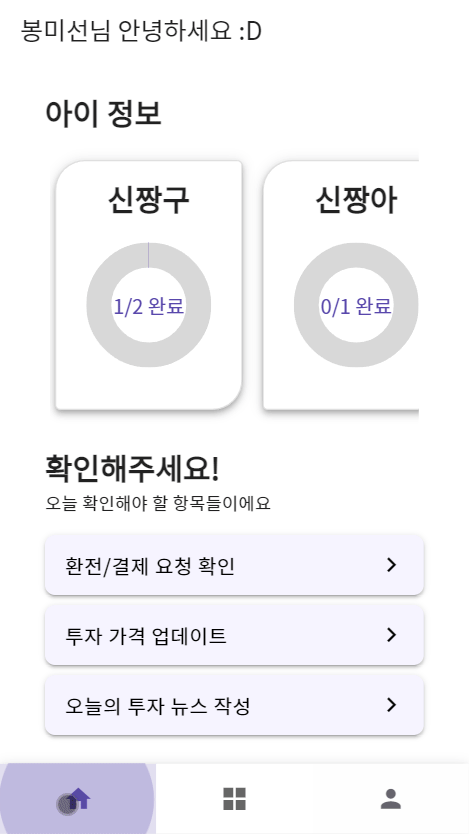
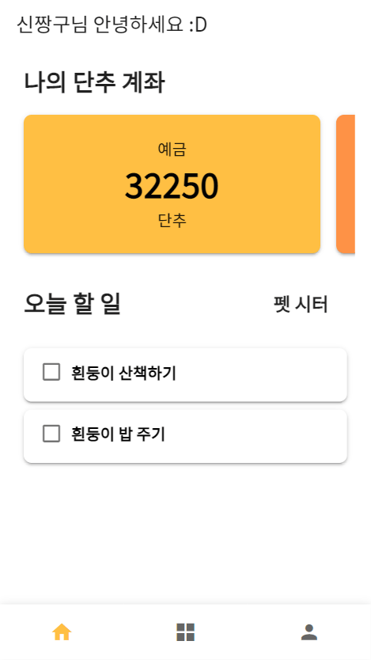

### 경제공부방

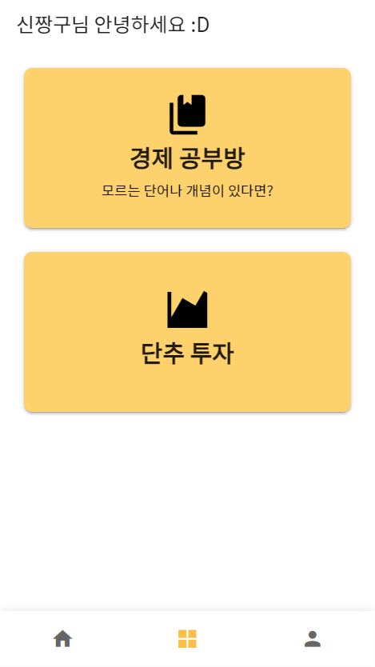

<br>

### ✨Developed by

|   **Name**   |                김응철                 |                김지언                |                  우정연                   |               유현수                |                 정은이                  |               황승연                |
| :----------: | :-----------------------------------: | :----------------------------------: | :---------------------------------------: | :---------------------------------: | :-------------------------------------: | :---------------------------------: |
| **Profile**  |     |    |         |   |       |   |
| **Position** |          Jira <br> Assignee           |          Git <br> Assignee           |           Release <br> Assignee           |        Frontend <br> Leader         |            Team <br> Leader             |         Backend <br> Leader         |
|   **Git**    | [GitHub](https://github.com/zbqlr456) | [GitHub](https://github.com/rlajiun) | [GitHub](https://github.com/WooJeongYeon) | [GitHub](https://github.com/82surf) | [GitHub](https://github.com/EuneeChung) | [GitHub](https://github.com/yeon-s) |

<br>

# 📃Tech Specifications

## 📚기술 스택

| Tech         | Stack                                  |
| ------------ | -------------------------------------- |
| **Language** | Java, JavaScript                       |
| **Backend**  | Spring Boot, JPA, Spring Security, JWT |
| **Frontend** | Vue.js, Vuetify, Vuex                  |
| **Database** | MariaDB                                |
| **Server**   | AWS EC2, NginX                         |
| **DevOps**   | Git, Docker                            |

<details>
<summary>🖥Backend 기술 자세히 보기</summary>
<div markdown="1">

    - Spring-Boot: 2.6.3
    - spring-boot-starter-data-jpa
    - spring-boot-starter-security
    - spring-boot-starter-web
    - p6spy-spring-boot-starter:1.8.0
    - springfox-swagger2:2.9.2
    - springfox-swagger-ui:2.9.2
    - swagger-annotations:1.5.21
    - io.swagger:swagger-models:1.5.21
    - io.jsonwebtoken:jjwt:0.9.1
    - lombok
    - spring-boot-devtools
    - mariadb-java-client

</div>
</details>

<details>
<summary>🎨Frontend 기술 자세히 보기</summary>
<div markdown="1">

    - vue
    - vue/cli
    - vue-router
    - vuex
    - vuex-persistedstate
    - vuetify
    - axios

</div>
</details>

<br>

## 시스템 아키텍처

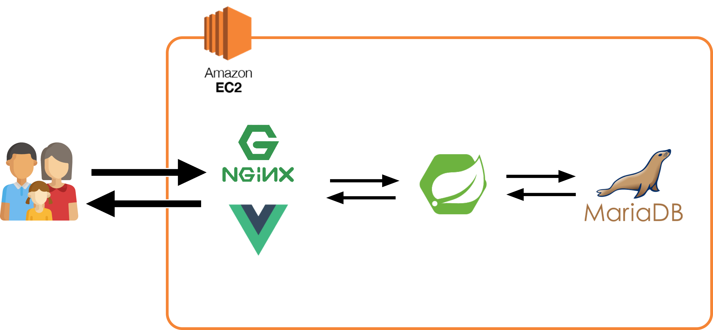

<br>

## [ERD](https://www.erdcloud.com/d/fEbqnr9diEWmQQvGZ)

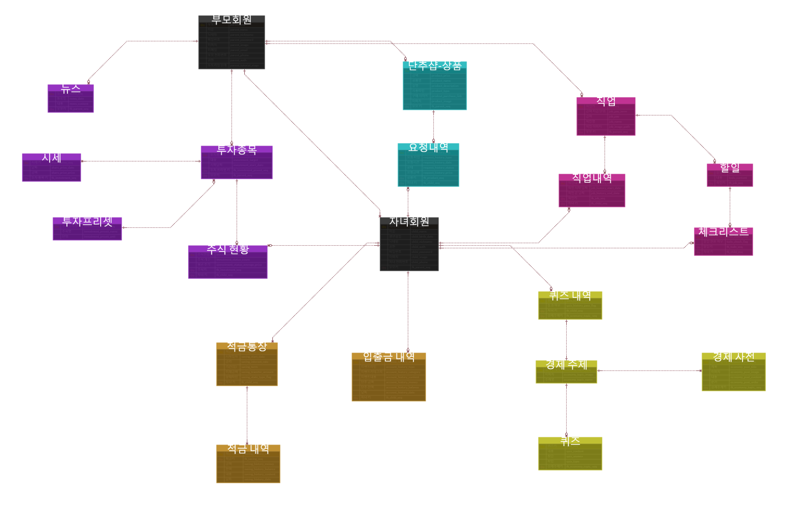

<br>

## 📂Package Structure

### 🖥Backend

> 계층, 컴포넌트, 기능 순으로 패키지 구성

<details>
<summary>Backend 구조 자세히 보기</summary>
<div markdown="1">  
     
```
📦buttonup
 ┣ 📂config
 ┃ ┣ 📂security
 ┃ ┃ ┣ 📜JwtAuthenticationFilter.java
 ┃ ┃ ┣ 📜JwtTokenProvider.java
 ┃ ┃ ┗ 📜WebSecurityConfig.java
 ┃ ┣ 📜SwaggerConfig.java
 ┃ ┗ 📜WebConfig.java
 ┣ 📂controller
 ┃ ┣ 📂account
 ┃ ┃ ┗ 📜AccountController.java
 ┃ ┣ 📂economy
 ┃ ┃ ┗ 📜EconomyController.java
 ┃ ┣ 📂invest
 ┃ ┃ ┣ 📜InvestController.java
 ┃ ┃ ┣ 📜NewsController.java
 ┃ ┃ ┗ 📜SharePriceController.java
 ┃ ┣ 📂job
 ┃ ┃ ┣ 📜JobController.java
 ┃ ┃ ┣ 📜ToDoCheckController.java
 ┃ ┃ ┗ 📜ToDoController.java
 ┃ ┣ 📂request
 ┃ ┃ ┗ 📜RequestController.java
 ┃ ┣ 📂saving
 ┃ ┃ ┗ 📜SavingController.java
 ┃ ┣ 📂user
 ┃ ┃ ┣ 📜ChildController.java
 ┃ ┃ ┗ 📜ParentController.java
 ┃ ┗ 📜ExceptionController.java
 ┣ 📂domain
 ┃ ┣ 📂model
 ┃ ┃ ┣ 📂dto
 ┃ ┃ ┃ ┣ 📂account
 ┃ ┃ ┃ ┃ ┣ 📂request
 ┃ ┃ ┃ ┃ ┃ ┗ 📜HistoryRequest.java
 ┃ ┃ ┃ ┃ ┗ 📂response
 ┃ ┃ ┃ ┃ ┃ ┗ 📜HistoryResponse.java
 ┃ ┃ ┃ ┣ 📂economy
 ┃ ┃ ┃ ┃ ┣ 📂response
 ┃ ┃ ┃ ┃ ┃ ┣ 📜PostResponse.java
 ┃ ┃ ┃ ┃ ┃ ┗ 📜QuizResponse.java
 ┃ ┃ ┃ ┃ ┗ 📜Quiz.java
 ┃ ┃ ┃ ┣ 📂invest
 ┃ ┃ ┃ ┃ ┣ 📂request
 ┃ ┃ ┃ ┃ ┃ ┣ 📜InvestRequest.java
 ┃ ┃ ┃ ┃ ┃ ┣ 📜InvestStatusRequest.java
 ┃ ┃ ┃ ┃ ┃ ┣ 📜NewsRequest.java
 ┃ ┃ ┃ ┃ ┃ ┗ 📜SharePriceRequest.java
 ┃ ┃ ┃ ┃ ┗ 📂response
 ┃ ┃ ┃ ┃ ┃ ┣ 📜InvestPresetResponse.java
 ┃ ┃ ┃ ┃ ┃ ┣ 📜InvestStatusResponse.java
 ┃ ┃ ┃ ┃ ┃ ┣ 📜NewsResponse.java
 ┃ ┃ ┃ ┃ ┃ ┣ 📜RoughInvestResponse.java
 ┃ ┃ ┃ ┃ ┃ ┗ 📜SharePriceResponse.java
 ┃ ┃ ┃ ┣ 📂job
 ┃ ┃ ┃ ┃ ┣ 📂request
 ┃ ┃ ┃ ┃ ┃ ┣ 📜JobHistoryRequest.java
 ┃ ┃ ┃ ┃ ┃ ┣ 📜JobRequest.java
 ┃ ┃ ┃ ┃ ┃ ┗ 📜ToDoCheckRequest.java
 ┃ ┃ ┃ ┃ ┗ 📂response
 ┃ ┃ ┃ ┃ ┃ ┣ 📜JobResponse.java
 ┃ ┃ ┃ ┃ ┃ ┣ 📜ToDoCheckResponse.java
 ┃ ┃ ┃ ┃ ┃ ┗ 📜ToDoResponse.java
 ┃ ┃ ┃ ┣ 📂request
 ┃ ┃ ┃ ┃ ┣ 📂request
 ┃ ┃ ┃ ┃ ┃ ┗ 📜ExchangeRequest.java
 ┃ ┃ ┃ ┃ ┗ 📂response
 ┃ ┃ ┃ ┃ ┃ ┗ 📜RequestHistoryResponse.java
 ┃ ┃ ┃ ┣ 📂saving
 ┃ ┃ ┃ ┃ ┣ 📂request
 ┃ ┃ ┃ ┃ ┃ ┣ 📜SavingCloseRequest.java
 ┃ ┃ ┃ ┃ ┃ ┗ 📜SavingRequest.java
 ┃ ┃ ┃ ┃ ┗ 📂response
 ┃ ┃ ┃ ┃ ┃ ┣ 📜SavingBalanceResponse.java
 ┃ ┃ ┃ ┃ ┃ ┣ 📜SavingCloseResponse.java
 ┃ ┃ ┃ ┃ ┃ ┣ 📜SavingDetailResponse.java
 ┃ ┃ ┃ ┃ ┃ ┗ 📜SavingHistoryResponse.java
 ┃ ┃ ┃ ┗ 📂user
 ┃ ┃ ┃ ┃ ┣ 📂request
 ┃ ┃ ┃ ┃ ┃ ┣ 📜ConnectRequest.java
 ┃ ┃ ┃ ┃ ┃ ┣ 📜JoinRequest.java
 ┃ ┃ ┃ ┃ ┃ ┣ 📜LoginRequest.java
 ┃ ┃ ┃ ┃ ┃ ┗ 📜TutorialRequest.java
 ┃ ┃ ┃ ┃ ┗ 📂response
 ┃ ┃ ┃ ┃ ┃ ┣ 📜ChildResponse.java
 ┃ ┃ ┃ ┃ ┃ ┣ 📜LoginResponse.java
 ┃ ┃ ┃ ┃ ┃ ┣ 📜ParentResponse.java
 ┃ ┃ ┃ ┃ ┃ ┗ 📜TutorialResponse.java
 ┃ ┃ ┗ 📂entity
 ┃ ┃ ┃ ┣ 📂account
 ┃ ┃ ┃ ┃ ┣ 📜AccountHistory.java
 ┃ ┃ ┃ ┃ ┣ 📜AccountHistoryCategory.java
 ┃ ┃ ┃ ┃ ┗ 📜AccountHistoryType.java
 ┃ ┃ ┃ ┣ 📂economy
 ┃ ┃ ┃ ┃ ┣ 📜EconomyPost.java
 ┃ ┃ ┃ ┃ ┣ 📜EconomyTopic.java
 ┃ ┃ ┃ ┃ ┣ 📜Quiz.java
 ┃ ┃ ┃ ┃ ┣ 📜QuizHistory.java
 ┃ ┃ ┃ ┃ ┗ 📜QuizType.java
 ┃ ┃ ┃ ┣ 📂invest
 ┃ ┃ ┃ ┃ ┣ 📜Investment.java
 ┃ ┃ ┃ ┃ ┣ 📜InvestPreset.java
 ┃ ┃ ┃ ┃ ┣ 📜InvestStatus.java
 ┃ ┃ ┃ ┃ ┣ 📜News.java
 ┃ ┃ ┃ ┃ ┗ 📜SharePrice.java
 ┃ ┃ ┃ ┣ 📂job
 ┃ ┃ ┃ ┃ ┣ 📜Job.java
 ┃ ┃ ┃ ┃ ┣ 📜JobHistory.java
 ┃ ┃ ┃ ┃ ┣ 📜JobImage.java
 ┃ ┃ ┃ ┃ ┣ 📜PayTerm.java
 ┃ ┃ ┃ ┃ ┣ 📜ToDo.java
 ┃ ┃ ┃ ┃ ┗ 📜ToDoCheck.java
 ┃ ┃ ┃ ┣ 📂product
 ┃ ┃ ┃ ┃ ┣ 📜Product.java
 ┃ ┃ ┃ ┃ ┗ 📜ProductType.java
 ┃ ┃ ┃ ┣ 📂request
 ┃ ┃ ┃ ┃ ┣ 📜RequestHistory.java
 ┃ ┃ ┃ ┃ ┣ 📜RequestHistoryStatus.java
 ┃ ┃ ┃ ┃ ┗ 📜RequestHistoryType.java
 ┃ ┃ ┃ ┣ 📂saving
 ┃ ┃ ┃ ┃ ┣ 📜Saving.java
 ┃ ┃ ┃ ┃ ┗ 📜SavingHistory.java
 ┃ ┃ ┃ ┗ 📂user
 ┃ ┃ ┃ ┃ ┣ 📜Child.java
 ┃ ┃ ┃ ┃ ┗ 📜Parent.java
 ┃ ┣ 📂repository
 ┃ ┃ ┣ 📂account
 ┃ ┃ ┃ ┗ 📜AccountRepository.java
 ┃ ┃ ┣ 📂economy
 ┃ ┃ ┃ ┣ 📜EconomyPostRepository.java
 ┃ ┃ ┃ ┣ 📜EconomyTopicRepository.java
 ┃ ┃ ┃ ┣ 📜QuizHistoryRepository.java
 ┃ ┃ ┃ ┗ 📜QuizRepository.java
 ┃ ┃ ┣ 📂invest
 ┃ ┃ ┃ ┣ 📜InvestPresetRepository.java
 ┃ ┃ ┃ ┣ 📜InvestRepository.java
 ┃ ┃ ┃ ┣ 📜InvestStatusRepository.java
 ┃ ┃ ┃ ┣ 📜NewsRepository.java
 ┃ ┃ ┃ ┗ 📜SharePriceRepository.java
 ┃ ┃ ┣ 📂job
 ┃ ┃ ┃ ┣ 📜JobHistoryRepository.java
 ┃ ┃ ┃ ┣ 📜JobImageRepository.java
 ┃ ┃ ┃ ┣ 📜JobRepository.java
 ┃ ┃ ┃ ┣ 📜ToDoCheckRepository.java
 ┃ ┃ ┃ ┗ 📜ToDoRepository.java
 ┃ ┃ ┣ 📂request
 ┃ ┃ ┃ ┗ 📜RequestHistoryRepository.java
 ┃ ┃ ┣ 📂saving
 ┃ ┃ ┃ ┣ 📜SavingHistoryRepository.java
 ┃ ┃ ┃ ┗ 📜SavingRepository.java
 ┃ ┃ ┗ 📂user
 ┃ ┃ ┃ ┣ 📜ChildRepository.java
 ┃ ┃ ┃ ┗ 📜ParentRepository.java
 ┃ ┗ 📂service
 ┃ ┃ ┣ 📂account
 ┃ ┃ ┃ ┗ 📜AccountService.java
 ┃ ┃ ┣ 📂common
 ┃ ┃ ┃ ┗ 📜ImageService.java
 ┃ ┃ ┣ 📂economy
 ┃ ┃ ┃ ┗ 📜EconomyService.java
 ┃ ┃ ┣ 📂invest
 ┃ ┃ ┃ ┣ 📜InvestService.java
 ┃ ┃ ┃ ┣ 📜InvestStatusService.java
 ┃ ┃ ┃ ┣ 📜NewsService.java
 ┃ ┃ ┃ ┗ 📜SharePriceService.java
 ┃ ┃ ┣ 📂job
 ┃ ┃ ┃ ┣ 📜JobService.java
 ┃ ┃ ┃ ┣ 📜ToDoCheckService.java
 ┃ ┃ ┃ ┗ 📜ToDoService.java
 ┃ ┃ ┣ 📂request
 ┃ ┃ ┃ ┗ 📜RequestService.java
 ┃ ┃ ┣ 📂saving
 ┃ ┃ ┃ ┗ 📜SavingService.java
 ┃ ┃ ┗ 📂user
 ┃ ┃ ┃ ┣ 📜ChildService.java
 ┃ ┃ ┃ ┣ 📜CustomuserDetailService.java
 ┃ ┃ ┃ ┣ 📜ParentService.java
 ┃ ┃ ┃ ┗ 📜TutorialService.java
 ┣ 📂exception
 ┃ ┣ 📜BalanceOverException.java
 ┃ ┣ 📜ExistInvestException.java
 ┃ ┗ 📜NullJobException.java
 ┗ 📜ButtonUpApplication.java
```

</div>
</details>

### 🎨Frontend

> api: axios 인스턴스를 활용한 API 모듈 <br>
> views: Router에서 default로 지정된 컴포넌트 <br>
> components: views에서 사용하는 컴포넌트, children으로 사용하는 컴포넌트, header, footer

<details>
<summary>Frontend 구조 자세히 보기</summary>
<div markdown="1">

```
📦src
 ┣ 📂api
 ┃ ┣ 📜accountsAPI.js
 ┃ ┣ 📜checkListAPI.js
 ┃ ┣ 📜childrenAPI.js
 ┃ ┣ 📜economyAPI.js
 ┃ ┣ 📜index.js
 ┃ ┣ 📜investAPI.js
 ┃ ┣ 📜jobsAPI.js
 ┃ ┣ 📜parentAPI.js
 ┃ ┣ 📜requestAPI.js
 ┃ ┣ 📜savingsAPI.js
 ┃ ┣ 📜todoListAPI.js
 ┃ ┗ 📜userAPI.js
 ┣ 📂assets
 ┃ ┣ 📂image
 ┃ ┃ ┣ 📜mockup-child-home-crop.png
 ┃ ┃ ┣ 📜mockup-child-home.png
 ┃ ┃ ┣ 📜mockup-child-invest-crop.png
 ┃ ┃ ┣ 📜mockup-child-invest.png
 ┃ ┃ ┣ 📜mockup-child-study.png
 ┃ ┃ ┣ 📜mockup-parent-exchange-crop.png
 ┃ ┃ ┣ 📜mockup-parent-exchange.png
 ┃ ┃ ┣ 📜mockup-parent-job-crop.png
 ┃ ┃ ┗ 📜mockup-parent-job.png
 ┃ ┣ 📂scss
 ┃ ┃ ┗ 📜style.scss
 ┃ ┗ 📂svg
 ┃ ┃ ┣ 📜child-work.svg
 ┃ ┃ ┣ 📜finance-app-animate.svg
 ┃ ┃ ┣ 📜growing.svg
 ┃ ┃ ┗ 📜piggy-bank-animate.svg
 ┣ 📂components
 ┃ ┣ 📂child
 ┃ ┃ ┣ 📂activity
 ┃ ┃ ┃ ┣ 📜InvestBtmSheet.vue
 ┃ ┃ ┃ ┣ 📜InvestGraph.vue
 ┃ ┃ ┃ ┣ 📜InvestTable.vue
 ┃ ┃ ┃ ┣ 📜NewsList.vue
 ┃ ┃ ┃ ┗ 📜StudyCard.vue
 ┃ ┃ ┣ 📂home
 ┃ ┃ ┃ ┣ 📜AccountHistoryBtmSheet.vue
 ┃ ┃ ┃ ┣ 📜AccountHistoryList.vue
 ┃ ┃ ┃ ┣ 📜MainAccountCard.vue
 ┃ ┃ ┃ ┗ 📜SavingHistoryBtmSheet.vue
 ┃ ┃ ┣ 📜InstallmentSaving.vue
 ┃ ┃ ┗ 📜NotSync.vue
 ┃ ┣ 📂common
 ┃ ┃ ┣ 📂headers
 ┃ ┃ ┃ ┣ 📜BackHeader.vue
 ┃ ┃ ┃ ┣ 📜GreetingHeader.vue
 ┃ ┃ ┃ ┗ 📜IndexHeader.vue
 ┃ ┃ ┣ 📜BottomNav.vue
 ┃ ┃ ┣ 📜BottomSheet.vue
 ┃ ┃ ┣ 📜CardMenu.vue
 ┃ ┃ ┣ 📜JobWithTodoListCard.vue
 ┃ ┃ ┣ 📜Modal.vue
 ┃ ┃ ┗ 📜TodoList.vue
 ┃ ┗ 📂parent
 ┃ ┃ ┣ 📂activity
 ┃ ┃ ┃ ┣ 📂NewInvest
 ┃ ┃ ┃ ┃ ┣ 📜priceInput.vue
 ┃ ┃ ┃ ┃ ┗ 📜selectInput.vue
 ┃ ┃ ┃ ┗ 📜JobCard.vue
 ┃ ┃ ┣ 📂home
 ┃ ┃ ┃ ┣ 📜ChildAccount.vue
 ┃ ┃ ┃ ┣ 📜ChildCardInfo.vue
 ┃ ┃ ┃ ┣ 📜Deposit.vue
 ┃ ┃ ┃ ┗ 📜Tutorial.vue
 ┃ ┃ ┣ 📂tutorial
 ┃ ┃ ┃ ┣ 📜TutorialChildSync.vue
 ┃ ┃ ┃ ┣ 📜TutorialDanchoo.vue
 ┃ ┃ ┃ ┣ 📜TutorialJob.vue
 ┃ ┃ ┃ ┗ 📜TutorialStock.vue
 ┃ ┃ ┗ 📜BottomNav.vue
 ┣ 📂config
 ┃ ┗ 📜index.js
 ┣ 📂plugins
 ┃ ┗ 📜vuetify.js
 ┣ 📂router
 ┃ ┣ 📂child
 ┃ ┃ ┣ 📜activity.js
 ┃ ┃ ┣ 📜home.js
 ┃ ┃ ┣ 📜shop.js
 ┃ ┃ ┗ 📜userInfo.js
 ┃ ┣ 📂common
 ┃ ┃ ┗ 📜common.js
 ┃ ┣ 📂parent
 ┃ ┃ ┣ 📜activity.js
 ┃ ┃ ┣ 📜home.js
 ┃ ┃ ┣ 📜requestList.js
 ┃ ┃ ┣ 📜tutorial.js
 ┃ ┃ ┗ 📜userInfo.js
 ┃ ┗ 📜index.js
 ┣ 📂sass
 ┃ ┗ 📜variables.scss
 ┣ 📂store
 ┃ ┣ 📂modules
 ┃ ┃ ┣ 📜accountStore.js
 ┃ ┃ ┣ 📜investStore.js
 ┃ ┃ ┣ 📜parentStore.js
 ┃ ┃ ┣ 📜savingStore.js
 ┃ ┃ ┗ 📜userStore.js
 ┃ ┗ 📜index.js
 ┣ 📂views
 ┃ ┣ 📂child
 ┃ ┃ ┣ 📂Activity
 ┃ ┃ ┃ ┣ 📜Invest.vue
 ┃ ┃ ┃ ┣ 📜Main.vue
 ┃ ┃ ┃ ┣ 📜News.vue
 ┃ ┃ ┃ ┣ 📜Saving.vue
 ┃ ┃ ┃ ┣ 📜Study.vue
 ┃ ┃ ┃ ┗ 📜StudyDetail.vue
 ┃ ┃ ┣ 📂home
 ┃ ┃ ┃ ┣ 📜AccountHistory.vue
 ┃ ┃ ┃ ┗ 📜Main.vue
 ┃ ┃ ┗ 📜Shop.vue
 ┃ ┣ 📂common
 ┃ ┃ ┣ 📜Index.vue
 ┃ ┃ ┣ 📜Login.vue
 ┃ ┃ ┣ 📜Signup.vue
 ┃ ┃ ┗ 📜UserInfo.vue
 ┃ ┗ 📂parent
 ┃ ┃ ┣ 📂activity
 ┃ ┃ ┃ ┣ 📜AddJob.vue
 ┃ ┃ ┃ ┣ 📜InvestDetail.vue
 ┃ ┃ ┃ ┣ 📜InvestManage.vue
 ┃ ┃ ┃ ┣ 📜JobManage.vue
 ┃ ┃ ┃ ┣ 📜Main.vue
 ┃ ┃ ┃ ┗ 📜NewInvest.vue
 ┃ ┃ ┣ 📂home
 ┃ ┃ ┃ ┣ 📜ChildInfo.vue
 ┃ ┃ ┃ ┗ 📜Home.vue
 ┃ ┃ ┣ 📜RequestList.vue
 ┃ ┃ ┗ 📜Tutorial.vue
 ┣ 📜App.vue
 ┗ 📜main.js
```

</div>
</details>

<br>

# 🔥Team Rules

## 🖥Backend

### 1. Entity Annotation

```java
@Entity  // table과 매핑할 클래스에 붙여주는 어노테이션
@Table(name = "table_name") // 엔티티와 매핑할 테이블 지정 - 동일해도 name 속성 필수 작성
@Getter // 클래스 위에서 붙여주면 클래스가 가지는 모든 멤버변수에 대한 get 함수생성
@DynamicInsert // INSERT구문 생성 시점에 null인 필드 제외 - 필요시에만 추가
@DynamicUpdate // update 시에 null인 필드 제외 - 필요시에만 추가
@NoArgsConstructor // 기본생성자 생성해주는 어노테이션
```

### 2. Entity Strategy

- **FK 설정시**  
   ManyToOne 쪽만 설정시, 반대 컬럼에 OneToMany 설정시 양방향 관계를 가지게 됨.  
   ⇒ **`양방향 지양`** , 반대 컬럼에 명시 X 해주고 **`단방향 연관 관계`** 로 사용!

### 3. DTO Annotation

```java
@ApiModel(value = "table data 추가 요청 정보") // swagger용 설명 수정
@Getter // 위와 동일
@Builder // DTO 생성 패턴
@NoArgsConstructor // 기본생성자
@AllArgsConstructor // 모든 필드값을 가지는 생성자
```

- **ResponseDTO**

  - 클라이언트에서 api를 호출해서 `서버에서 받는 데이터`
  - 서버에서 보내줘야하는 데이터

- **RequestDTO**
  - 클라이언트의 요청을 처리하기 위해 `서버에서 받아야하는 데이터`
  - 프론트에서 보내줘야하는 데이터

## 🎨Frontend

### 컴포넌트 구조

- views: router에서 default로 등록되는 컴포넌트
- components
  - views 내부에서 사용되는 컴포넌트
  - router에서 header, footer, children으로 연결되는 컴포넌트

### 함수 작성 시 접두사

> 함수명만 보고 어느 모듈에서 온 함수인지 구분할 수 있도록

```javascript
// 컴포넌트 내에서 만든 메서드 - 별도 접두사 없음
getUserInfo();

// vuex actions - vuex 접두사
vuexGetUserInfo();

// API function - api 접두사
apiGetUserInfo();
```

### 라우터, vuex, api 모듈화

> 코드 가독성과 유지보수를 위해 router, vuex, api 파일을 모듈화

<br>
<br>

## 첫단추 Wiki 바로가기

### [🌝첫 단추 HOME](https://lab.ssafy.com/s06-webmobile2-sub2/S06P12B205/-/wikis/home)

---

##### 기획

[🤝첫 단추의 철학](https://lab.ssafy.com/s06-webmobile2-sub2/S06P12B205/-/wikis/첫단추의-철학)  
[📜기능 명세서](https://docs.google.com/spreadsheets/d/1hQY69DIqmML3cubXh1oSkBYgT4yhRZiXsK6mI_f-EeI/edit#gid=0)  
[🖼와이어 프레임](https://www.figma.com/file/WZHm2zGmlgqLCwbs7ftYLR/%EC%B2%AB%EB%8B%A8%EC%B6%94?node-id=585%3A3019)  
[🎾API 설계서](https://docs.google.com/spreadsheets/d/1hQY69DIqmML3cubXh1oSkBYgT4yhRZiXsK6mI_f-EeI/edit#gid=1081310975)

---

[🤝Convention](https://lab.ssafy.com/s06-webmobile2-sub2/S06P12B205/-/wikis/%F0%9F%A4%9DConvention)

---

###### [🚨Issues](https://lab.ssafy.com/s06-webmobile2-sub2/S06P12B205/-/wikis/%F0%9F%9A%A8Issues)

- [🐽적금 통장 컬럼 - 잔액](https://lab.ssafy.com/s06-webmobile2-sub2/S06P12B205/-/wikis/적금-통장-컬럼---잔액)

---

##### [🎫Meeting Log](https://lab.ssafy.com/s06-webmobile2-sub2/S06P12B205/-/wikis/%F0%9F%8E%ABMeeting-Log)

😚 1주차 : 2022.01.08-2022.01.14

> 아이디어 회의 진행

###### 😊 2주차 : 2022.01.15-2022.01.21

[1월 17일 회의록](https://lab.ssafy.com/s06-webmobile2-sub2/S06P12B205/-/wikis/1월-17일-회의)  
[1월 18일 회의록](https://lab.ssafy.com/s06-webmobile2-sub2/S06P12B205/-/wikis/1월-18일-회의)  
[1월 19일 회의록](https://lab.ssafy.com/s06-webmobile2-sub2/S06P12B205/-/wikis/1월-19일-회의)  
[1월 21일 회의록](https://lab.ssafy.com/s06-webmobile2-sub2/S06P12B205/-/wikis/1월-21일-회의)

###### 🤔 3주차 : 2022.01.22-2022.01.28

[1월 24일 회의록](https://lab.ssafy.com/s06-webmobile2-sub2/S06P12B205/-/wikis/1월-24일-회의)  
[1월 25일 회의록](https://lab.ssafy.com/s06-webmobile2-sub2/S06P12B205/-/wikis/1월-25일-회의)  
[1월 26일 회의록](https://lab.ssafy.com/s06-webmobile2-sub2/S06P12B205/-/wikis/1월-26일-회의)
